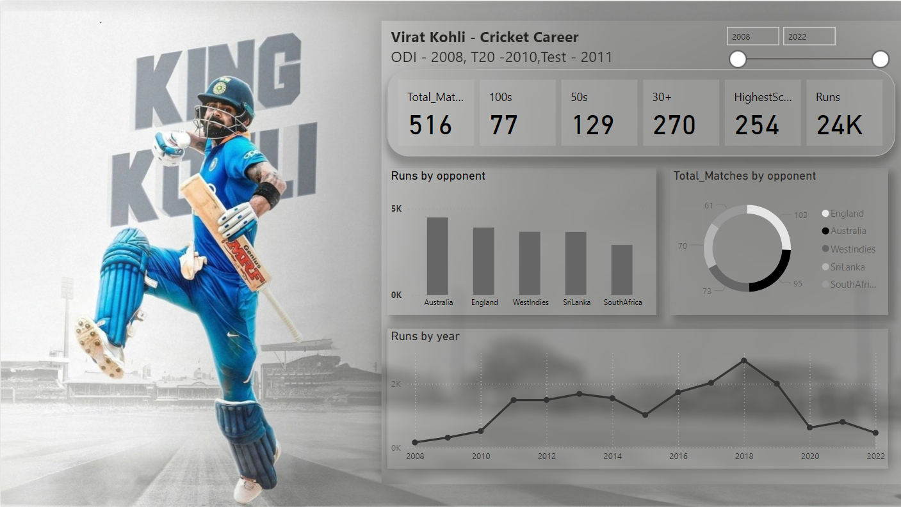

# Virat Kohli - Cricket Career Dashboard

This Power BI dashboard provides an in-depth analysis of  Virat Kohli's illustrious cricket career across different formats:
ODI (debut in 2008), T20 (debut in 2010), and Test (debut in 2011). The dashboard offers a comprehensive view of his performance from 2008 to 2022.

# Key Features:

# Stacked Area Chart: 
Visualizes the runs scored by Virat Kohli year-by-year from 2008 to 2022, providing insights into his consistency and peaks in performance.

# Clustered Column Chart:
Breaks down the total runs scored against various cricketing nations, highlighting his performance against specific opponents.

# Donut Chart:
Represents the total number of matches played against key opponents including England, Australia, West Indies, Sri Lanka, and South Africa.

# Summary Card:
Displays essential career statistics, including total matches played, centuries (100s), half-centuries (50s), total runs scored, and his highest individual score.

This dashboard serves as a powerful tool for cricket enthusiasts and analysts to explore and understand the career trajectory of one of the modern era's greatest cricketers, Virat Kohli.

# PowerBi | Data analysis | Visualisation | Dashboard | Dax
